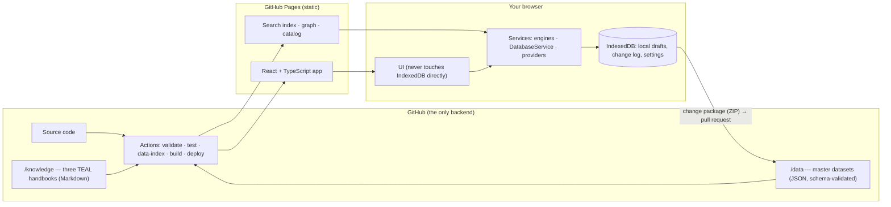

# TEAL Intelligence

**Industrial Intelligence + Product Development + Equipment Simulation Operating System.**
TEAL moves from a market or customer requirement to a technically defensible equipment architecture,
selects candidate technologies and components from a structured engineering database, simulates the
equipment, understands cost, capacity and risk, validates the design — and keeps the resulting
engineering knowledge for the next product.

`UNDERSTAND → CONFIGURE → ENGINEER → SIMULATE → OPTIMIZE → VALIDATE → BUILD → SCALE`

Flagship module: **Equipment Simulation Studio** (see [docs/09](docs/09_ENGINEERING_SIMULATION_OS.md)) with the **3D Machine Digital Twin** — an interactive Three.js machine for every equipment template (laser marking and welding, assembly, test, handling, dispensing …) driven by the same simulation, BOM and requirements (see [docs/10](docs/10_3D_MACHINE_DIGITAL_TWIN.md), open `#/3d`). Every component has a technical + supplier datasheet at `#/component-datasheets`.

It begins with Laser, where TEAL is strongest, and is built so the same intelligence system extends
across Electronics & EMS, Semiconductor, Battery & New Energy, Industrial Automation and Advanced
Manufacturing — one reusable product-development intelligence OS, not a collection of tools.

## Product vision & business purpose

Capture TEAL's technology and product-development knowledge in one system, connect it with
suppliers, applications, costs and projects, and speed up the conversion of opportunities into
scalable products:

```
MARKET → CUSTOMER → OPPORTUNITY → TECHNOLOGY → APPLICATION → PRODUCT → ARCHITECTURE → SUPPLIER
       → BOM → COST → LOCALIZATION → POC → PROJECT → VALIDATION → COMMERCIALIZATION
```

Five capabilities: **Technology intelligence** (technologies, TRL-based maturity, gaps) ·
**Product development** (requirement → architecture → BOM → prototype → POC → validation) ·
**Ecosystem intelligence** (suppliers, partners, customers) · **Cost & localization** (BOM, landed
cost, import dependency, target cost, margin) · **Execution** (projects, milestones, POCs, risks).

## Architecture



Provider seams (`src/services/providers.ts`) — **DataRepository · AuthProvider · SearchProvider ·
SyncProvider** — let a real backend be attached later without rebuilding the frontend. Today they
are honest static/local implementations: no server, no accounts, sync by reviewed pull request.

## Domains

| Domain | What it holds |
|---|---|
| Laser & Photonics | laser technologies, applications, subsystems; beam path; sources, optics, galvo; process, DOE, calculators |
| Electronics & EMS | SMT/THT processes, inspection (AOI/SPI/AXI), test, depaneling, laser applications, component categories, EMS equipment |
| Semiconductor | design → final packing lifecycle, front-end, back-end/ATMP, laser applications, equipment database |
| Battery & New Energy | chemistries, cell form factors, 19-step cell process, laser applications, equipment |
| Industrial Automation | mechanical · electrical · controls · motion · robotics · vision · software · safety · pneumatics · process · data |
| Advanced Manufacturing | reserved — taxonomy to be defined by TEAL |

Domains are **data** (`data/domains/domains.json`): adding one is a new record, not a redesign.

## Equipment Simulation Studio and the engineering database

| | |
|---|---|
| **Equipment Simulation Studio** `/studio` | 35 equipment templates → scenario → architecture (stations, buffers, parallel servers, variability) → component selection with live compatibility → laser & optics physics → cycle time, UPH, OEE, capacity, bottleneck with data lineage → discrete-event material flow with animated replay → Monte Carlo (P50–P99) → what-if → optimisation (Pareto frontier) → 2D digital twin + machine states → automation sequence → faults, maintenance, energy → multi-level BOM and equipment cost → supplier dependency, localization, disruption → design review, DFM/DFA, build and POC readiness → verification, measured values, calibration → versions and diffs → simulation report / customer proposal |
| **Global Engineering Database** `/engineering-db` | manufacturers, products with dynamic specifications and field-level evidence, natural-language technical search (“1064 nm 50 W MOPA”), technical filters, compatibility rules and relationships, comparison without ranking, source registry and controlled ingestion, TEAL overlay |
| **Data Review Center** `/data-review` | new · changed · conflicting · duplicate · missing · stale · unverified — approve, reject, merge, edit, archive, restore |

Engineering decision-support simulation — not FEA, CFD, optical ray-tracing or a validated factory
twin. The database ships **DEMO** products from fictional manufacturers; no real specification, price
or certification was invented.

## Modules

Navigation follows the §4 information architecture: **Home · Intelligence · Industries · Applications ·
Requirements · Products · Equipment Simulation · Engineering · BOM & Cost · Suppliers · Projects · Quality ·
Service · Knowledge · Documents · Risks · Business Case · Admin.** Engineering / Customer view mode hides
internal cost, suppliers and risks for customer presentations.

| Area | Pages |
|---|---|
| Home | Executive Command Center (KPIs that open their records, attention, business flow), Action Center, My Workspace, Dashboards, Rooms |
| Intelligence | Technology Radar (rings + TRL maturity), Cross-Domain Map, Compare, Market & Business Case, Opportunity Matrix, Global Intelligence, Application Engine, Use Cases, Applications, Materials, Ask Intelligence, handbooks, articles, search (incl. technical parameters), evidence, lessons, graph, memory, reuse, gaps, changes, AI context |
| Domains | six domain hubs, Laser Platform & laser pages, Semiconductor intelligence, Equipment Buyer, Modules, Architecture canvas, Machines, Equipment |
| Product | Products, Product Development (17-stage lifecycle), Product from Inquiry, Requirement Capture, Requirements, Traceability, Configurator, Platformization, Product Architecture, BOMs, Components, Cost, Localization, Documents (11 templates) |
| Ecosystem | Suppliers, Supplier Risk, Procurement, RFQs, Partners, Customers, LeadConnect |
| Execution | My Workspace, Tasks & Milestones (kanban · table · timeline · calendar · milestones · risk matrix), Projects, POCs, Opportunities, Activities, Risk & FMEA, Gates, Decisions, Change Requests, FAT/SAT, Production Release, Field Service |
| Roadmap · Data · Settings | Roadmap 2026 → 2030+; Data Manager, Data Health, Import / Export, Duplicates, Reports, Legacy apps; Settings, Help |

⌘K / Ctrl K command palette · `/` search · `N` create · `G` then `H/W/P/L/K` go · `F` focus · `?` shortcuts.

## Data model & trust

One registry (`src/domain/registry.ts`) maps each entity to its Zod schema, id prefix, route and
search partition; JSON Schemas are generated from it. Every record carries a data type and a
verification status, shown as one trust label: **VERIFIED · REFERENCE · ESTIMATED · USER ADDED ·
TO BE VALIDATED · DEMO DATA**. Unknown values show **UNKNOWN**; demo records are fictional and
labelled; POC, DOE, FAT and SAT results are never pre-filled; no TRL, market size, supplier
capability or score is invented.

## Local database

IndexedDB (Dexie) holds **local drafts**, the change log, recents, saved searches and settings.
UI code goes through `DatabaseService` — no component opens a table. Drafts show as **LOCAL DATA**
until exported, then **SYNC PENDING** for changes made after the last export. *Permanent repository
update requires a GitHub commit.*

## GitHub architecture & Actions

`validate.yml` (install, data validation, generated-file and secret checks, typecheck, lint) ·
`test.yml` (unit, integration, Playwright end-to-end with axe) · `data-quality.yml` ·
`data-index.yml` (catalog, graph, search index) · `build.yml` · `deploy.yml`
(Push → Install → Lint → Type check → Validate data → Test → Build → Deploy to GitHub Pages).

## Run it

```bash
npm ci
npm run dev          # prepares data, then Vite dev server
npm run build        # data → schemas → catalog → graph → search index → app (dist/)
npm run check        # typecheck + lint + unit/integration tests
npm run test:e2e     # Playwright against the production build (npm run build first)
```

Node 22. Served under `/TEAL-Intelligence-/` in production (set by `GITHUB_REPOSITORY`).

## Change master data

1. Work in the app — new/edited records are **LOCAL DRAFTS** in your browser.
2. Data → Import / Export → **Export change package** (ZIP).
3. `npm run data:apply -- teal-change-package-YYYY-MM-DD.zip` then `npm run data:catalog`.
4. Open a pull request. CI validates schemas, references and data quality. Merge → deploy.

## Security & limitations

* **This repository is public.** Do not commit customer names, drawings, quotations, confidential
  BOMs or prices, NDA material, personal data or secrets. `applyChangePackage` refuses customer-type
  records unless you confirm they are not confidential. See [docs/SECURITY.md](docs/SECURITY.md).
* A static site has **no authentication or access control**. The optional LOCAL WORKSPACE LOCK is a
  convenience, not security. No API keys, tokens or passwords exist in the code.
* **No AI model is connected.** Ask Intelligence is local retrieval over records and handbooks;
  the AI Context page prepares context for an assistant you choose.
* Nothing syncs automatically; collaboration is by pull request.

## Future roadmap

A real backend behind the provider and repository seams (PostgreSQL, object storage, search, ingestion
workers, authentication, RBAC, live sync); real engineering data through the reviewed ingestion pipeline;
a 3D twin, line/factory simulation and external simulation integrations; an AI layer
over the structured data (natural-language technical search, requirement → architecture
recommendation, BOM and cost analysis, document analysis); sourced equipment, supplier and market
datasets through the reviewed ingestion pipeline; the Advanced Manufacturing taxonomy.

## Documentation

| Plan | Reference |
|---|---|
| [01 Repository audit](docs/01_REPOSITORY_AUDIT.md) | [Architecture](docs/ARCHITECTURE.md) · [Database](docs/DATABASE.md) · [Data model](docs/DATA_MODEL.md) |
| [02 Legacy feature map](docs/02_LEGACY_FEATURE_MAP.md) | [Product engine](docs/PRODUCT_ENGINE.md) · [Cost engine](docs/COST_ENGINE.md) · [Gates](docs/GATES.md) |
| [03 Target architecture](docs/03_TARGET_ARCHITECTURE.md) | [Knowledge](docs/KNOWLEDGE.md) · [Ingestion](docs/INGESTION.md) · [Global intelligence](docs/GLOBAL_INTELLIGENCE.md) |
| [04 Data model](docs/04_DATA_MODEL.md) · [05 Migration](docs/05_MIGRATION_PLAN.md) · [06 Roadmap](docs/06_IMPLEMENTATION_ROADMAP.md) | [Security](docs/SECURITY.md) · [Deployment](docs/DEPLOYMENT.md) · [Testing](docs/TESTING.md) |
| [07 UX redesign](docs/07_UX_REDESIGN.md) · [08 Intelligence OS](docs/08_INTELLIGENCE_OS.md) · [09 Engineering & Simulation OS](docs/09_ENGINEERING_SIMULATION_OS.md) · [10 3D Machine Digital Twin](docs/10_3D_MACHINE_DIGITAL_TWIN.md) | [Migration](docs/MIGRATION.md) |
